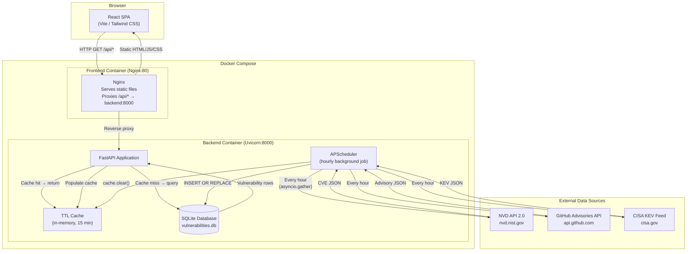
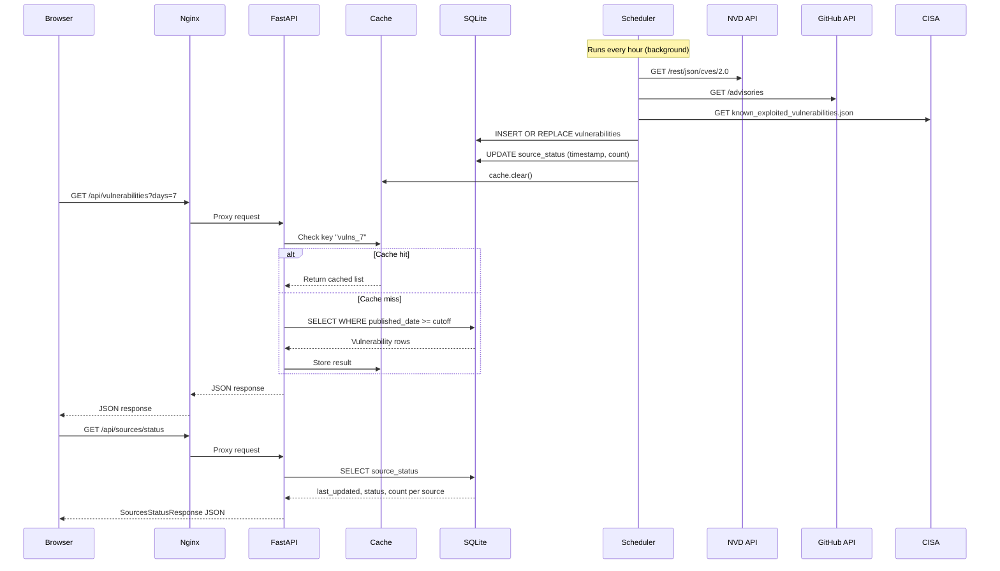
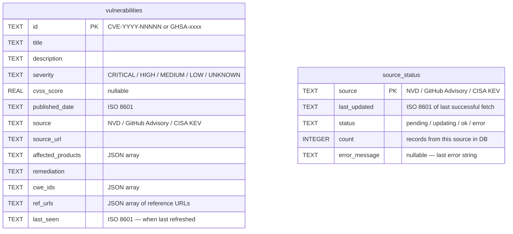
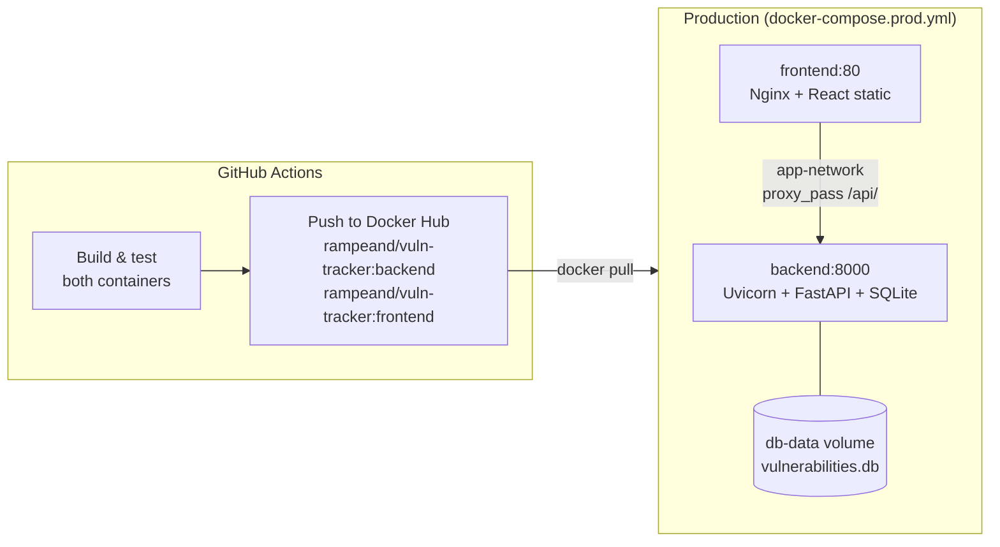

# Vulnerability Tracker &mdash; Architecture

## Overview

Vulnerability Tracker is a containerised, two-service application that aggregates CVE and advisory data from three public sources (NVD, GitHub Security Advisories, CISA KEV), stores it in a local SQLite database refreshed hourly, and serves it through a React single-page dashboard behind an Nginx reverse proxy.

---

## System Architecture



---

## Request / Response Flow



---

## Component Breakdown

### Frontend (`src/`)

```
src/
├── App.jsx               # Root: state management, data fetching, layout
├── main.jsx              # React entry point (createRoot)
├── index.css             # Tailwind CSS directives + global resets
└── components/
    ├── FilterBar.jsx     # Time-range / severity / source / text-search controls
    ├── StatsPanel.jsx    # Summary cards (total + per-severity counts)
    ├── SourceStatus.jsx  # Per-source timestamps, status, refresh buttons
    ├── VulnerabilityCard.jsx  # Expandable card for one CVE / advisory
    └── LoadingSpinner.jsx     # Async loading indicator
```

| Component | Responsibility |
|-----------|---------------|
| `App.jsx` | Owns all state; fetches `/api/vulnerabilities`, `/api/stats`, `/api/sources/status`; wires refresh callbacks |
| `FilterBar.jsx` | Emits filter changes that trigger re-fetches in `App` |
| `StatsPanel.jsx` | Displays aggregate counts; pure presentational component |
| `SourceStatus.jsx` | Shows health / timestamp per source; calls `POST /api/sources/refresh` on button click |
| `VulnerabilityCard.jsx` | Renders one vulnerability; expands to show full details, CWE links, references |

### Backend (`backend/`)

```
backend/
├── main.py              # FastAPI app, data-fetch functions, DB layer, scheduler
├── requirements.txt     # Python dependencies
├── Dockerfile           # Python 3.11-slim image
└── vulnerabilities.db   # SQLite database (auto-created at startup, gitignored)
```

| Layer | Implementation | Purpose |
|-------|---------------|---------|
| HTTP Server | Uvicorn (ASGI) | Serves the FastAPI application |
| API Framework | FastAPI + Pydantic | Request routing, validation, auto-generated OpenAPI docs |
| Scheduler | APScheduler `AsyncIOScheduler` | Hourly `refresh_all_sources()` background job |
| Cache | `cachetools.TTLCache` | 15-minute in-memory cache keyed by `days` param |
| Persistence | SQLite via `aiosqlite` | Stores all vulnerability + source status data |
| HTTP Client | `httpx.AsyncClient` | Concurrent async fetches from external APIs |

---

## Database Schema



> **Note:** The database column is named `ref_urls` (not `references`) because `REFERENCES` is a reserved SQL keyword in SQLite. The Pydantic model and JSON API response still use the field name `references`.

---

## API Endpoints

| Method | Path | Description |
|--------|------|-------------|
| `GET` | `/api/vulnerabilities` | Filtered, sorted vulnerability list (from cache or DB) |
| `GET` | `/api/stats` | Severity and source counts for the current look-back window |
| `GET` | `/api/sources/status` | Per-source last-update timestamp, status, record count, next scheduled refresh |
| `POST` | `/api/sources/refresh` | Trigger immediate on-demand refresh (body: `{"source": "NVD"}` or `{}` for all) |
| `GET` | `/health` | Liveness probe (`{"status": "healthy"}`) |

Query parameters for `/api/vulnerabilities`:

| Param | Type | Default | Description |
|-------|------|---------|-------------|
| `days` | int (1 &ndash; 30) | `2` | Look-back window |
| `severity` | string | &mdash; | `CRITICAL`, `HIGH`, `MEDIUM`, `LOW` |
| `source` | string | &mdash; | `NVD`, `GitHub`, `CISA` (substring match) |
| `search` | string | &mdash; | Free-text search in ID, title, description |

---

## Data Sources

| Source | Endpoint | Data Provided | Rate Limit |
|--------|----------|--------------|------------|
| **NVD** | `services.nvd.nist.gov/rest/json/cves/2.0` | CVE ID, CVSS (v3.1 &rarr; v3.0 &rarr; v2.0), CWE, CPE products, references | 5 req / 30 sec (no API key) |
| **GitHub Advisories** | `api.github.com/advisories` | GHSA/CVE ID, package ecosystem, CVSS, severity | 60 req / hr (unauthenticated) |
| **CISA KEV** | `cisa.gov/.../known_exploited_vulnerabilities.json` | CVE ID, vendor/product, required action, due date (always CRITICAL) | No limit (static JSON) |

---

## Deployment



### Container Details

| Container | Base Image | Exposed Port | Key Responsibilities |
|-----------|-----------|-------------|---------------------|
| **frontend** | `nginx:stable-alpine` | 80 | Serve static React build; reverse-proxy `/api/*` and `/health` to backend |
| **backend** | `python:3.11-slim` | 8000 | FastAPI server, APScheduler, SQLite persistence, external API fetching |

### Nginx Proxy

The frontend container's `nginx.conf` uses Docker's embedded DNS resolver (`127.0.0.11`) with a variable-based `proxy_pass` so the backend hostname is re-resolved on each request. This avoids stale-DNS 502 errors when the backend container restarts.

### Environment Variables

| Variable | Default | Description |
|----------|---------|-------------|
| `VITE_API_URL` | `http://localhost:8000` | Backend URL (dev only; production uses the Nginx proxy) |
| `DB_PATH` | `vulnerabilities.db` | SQLite database file path (backend) |

---

## Technology Stack

| Layer | Technology | Version |
|-------|-----------|---------|
| Frontend framework | React | 19.2 |
| Build tool | Vite | 7.3 |
| CSS framework | Tailwind CSS | 4.2 |
| Backend framework | FastAPI | 0.115 |
| ASGI server | Uvicorn | 0.30 |
| Scheduler | APScheduler | 3.10 |
| Database | SQLite (aiosqlite) | stdlib + 0.20 |
| HTTP client | HTTPX | 0.27 |
| Data validation | Pydantic | 2.9 |
| Reverse proxy | Nginx | stable-alpine |
| Containerisation | Docker + Compose | &mdash; |
| CI/CD | GitHub Actions | &mdash; |
